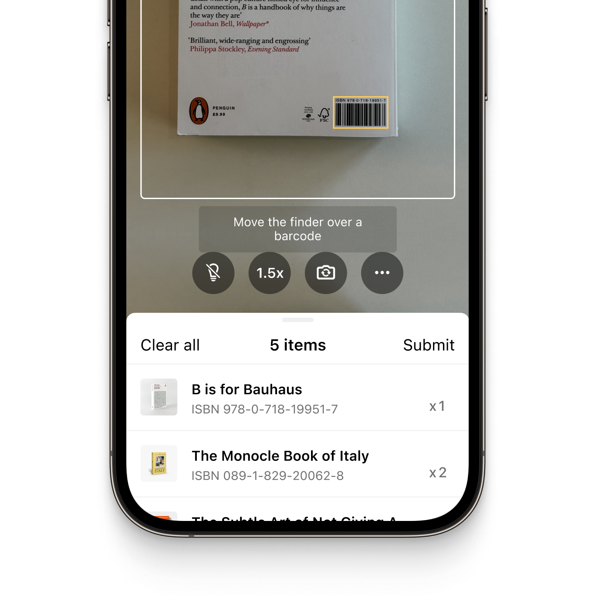
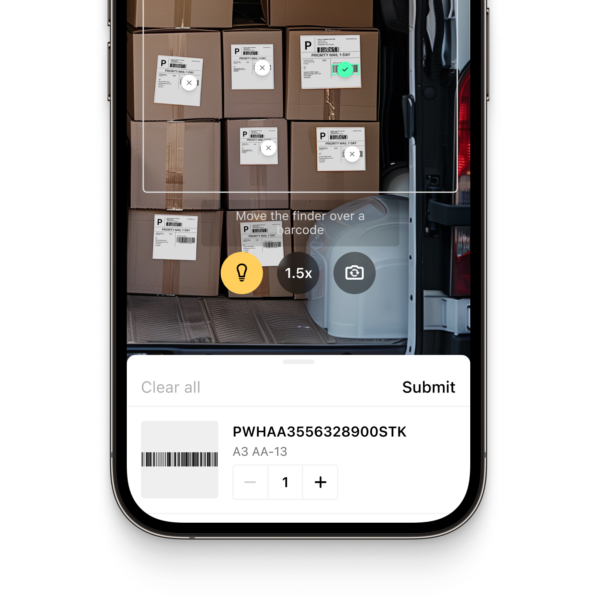

<p align="left">
  
</p>
<p align="left">
  
</p>

# Example App for the Scanbot Flutter Barcode Scanner SDK

This sample app demonstrates how to integrate the Scanbot Flutter barcode scanning library into your Flutter apps. 

## What is the Scanbot Barcode Scanner SDK?

The Scanbot [Barcode Scanner SDK](https://scanbot.io/barcode-scanner-sdk/?utm_source=github.com&utm_medium=referral&utm_campaign=dev_sites) is a simple and intuitive high-level Flutter plugin that allows you to integrate fast and reliable barcode scanning for both Android and iOS.

The SDK utilizes your device's camera, which can be freely switched. You can also apply various filters to narrow down the results by barcode type or content, with regex pattern support to ensure you only capture the specific barcodes relevant to your application.

It operates entirely offline on the user's mobile device and takes only 0.04 seconds per scan. Scans are accurate even under challenging conditions, including damaged, small, or distant barcodes and low-light backgrounds.

The SDK can be implemented into your Flutter project with just a few lines of code and comes with Ready-To-Use UI components.

💡 For more details about the Scanbot Flutter Barcode Scanner, please see our [documentation](https://docs.scanbot.io/flutter/barcode-scanner-sdk/introduction/?utm_source=github.com&utm_medium=referral&utm_campaign=dev_sites) or visit our [pub dev page](https://pub.dev/publishers/scanbot.io/packages) to download our Flutter packages.

## Requirements

### Dev tools

* Latest [Flutter SDK](https://flutter.dev/)
* For Android apps: Android SDK (API Level 21+), platforms and developer tools
* For iOS apps: macOS with latest Xcode and command line tools

### Mobile platforms

* Android 5.0 (API Level 21) and higher
* iOS 13 and higher

## How to run the sample app

### Step 1: Install Flutter & Dependencies

Install [Flutter](https://flutter.dev/) and all required dev tools.

Clone this repository and navigate to the project directory.

```
cd scanbot-barcode-scanner-sdk-example-flutter/
```

Fetch and install the dependencies of this example project via Flutter CLI:

```
flutter pub get
```

Connect a mobile device via USB and run the app.

### Step 2: Start your application

**Android:**

```
flutter run -d <DEVICE_ID>
```

You can get the IDs of all connected devices with `flutter devices`.

**iOS:**

Install Pods dependencies:

```
cd ios/
pod install --repo-update
```

Open the **workspace**(!) `ios/Runner.xcworkspace` in Xcode and adjust the *Signing / Developer Account* settings. Then, build and run the app in Xcode.

## Features of the Scanbot Barcode Scanner Flutter Plugin

### Out-of-the-box barcode scanning workflows

The Scanbot Barcode Scanner SDK offers the following scan modes, which are available out of the box in our ready-to-use UI.

#### Single Scanning

This is the Barcode Scanner SDK's default scanning mode. It is optimized for detecting a single barcode at a time and is easily configurable to your needs. You can show a confirmation screen after scanning the barcode. 

#### Batch & Multi Scanning

The barcode scanner plugin can also be configured to scan multiple barcodes in succession (without closing the scanning interface every time), to capture multiple barcodes from the camera view at once, or to count the scanned items.

#### Find & Pick 

Given one or more barcodes, the SDK will visually highlight the barcode on the user's screen and scan the correct items for your users. It automatically selects the barcode with the right barcode value from your camera feed. 

|  |  |  |
| :-- | :-- | :-- |

### AR Overlay

The Scanbot barcode scanning plugin includes an optional barcode Overlay for all scanning workflows. It provides real-time barcode highlighting, preview, and tap-to-select functionalities.

Recognized barcodes are highlighted with a customizable frame and text, clearly distinguishing scanned from unscanned items. This allows your users to select barcodes manually by tapping or instead rely on automatic selection. 

### Scanning barcodes from an image

The Scanbot SDK also offers barcode scanning support for still images, enabling barcode detection from JPG and other image files. It supports single-image and multi-image detection and returns a list with the recognized barcodes.

### Supported barcodes

The Scanbot barcode scanner library supports all common 1D- and 2D barcodes, such as QR codes or Aztec Codes, as well as multiple postal symbologies, including:

| Barcode type       | Barcode symbologies                                                                                                                                                                                                                                                                                                                                                                                                                                                                                                                                                                                                                                                                                                                                                                                                                                                                                                                                                                                                                                                                                                                                                               |
|:-------------------|:----------------------------------------------------------------------------------------------------------------------------------------------------------------------------------------------------------------------------------------------------------------------------------------------------------------------------------------------------------------------------------------------------------------------------------------------------------------------------------------------------------------------------------------------------------------------------------------------------------------------------------------------------------------------------------------------------------------------------------------------------------------------------------------------------------------------------------------------------------------------------------------------------------------------------------------------------------------------------------------------------------------------------------------------------------------------------------------------------------------------------------------------------------------------------------|
| 1D Barcodes        | [EAN](https://scanbot.io/barcode-scanner-sdk/ean/?utm_source=github.com&utm_medium=referral&utm_campaign=dev_sites), [UPC](https://scanbot.io/barcode-scanner-sdk/upc/?utm_source=github.com&utm_medium=referral&utm_campaign=dev_sites), [Code 128](https://scanbot.io/barcode-scanner-sdk/code-128/?utm_source=github.com&utm_medium=referral&utm_campaign=dev_sites), [GS1-128](https://scanbot.io/barcode-scanner-sdk/gs1-128/?utm_source=github.com&utm_medium=referral&utm_campaign=dev_sites), [Code 39](https://scanbot.io/barcode-scanner-sdk/code-39/?utm_source=github.com&utm_medium=referral&utm_campaign=dev_sites), [Codabar](https://scanbot.io/barcode-scanner-sdk/codabar/?utm_source=github.com&utm_medium=referral&utm_campaign=dev_sites),  [ITF](https://scanbot.io/barcode-scanner-sdk/itf-code/?utm_source=github.com&utm_medium=referral&utm_campaign=dev_sites), Code 25, Code 32, Code 93, Code 11, MSI Plessey, Standard 2 of 5, IATA 2 of 5, Databar (RSS), GS1 Composite                                                                                                                                                                                                                                          |
| 2D Barcodes        | [QR Codes](https://scanbot.io/glossary/qr-code/?utm_source=github.com&utm_medium=referral&utm_campaign=dev_sites), [Micro QR Codes](https://scanbot.io/barcode-scanner-sdk/micro-qr-code/?utm_source=github.com&utm_medium=referral&utm_campaign=dev_sites), [Aztec Code](https://scanbot.io/barcode-scanner-sdk/aztec-code/?utm_source=github.com&utm_medium=referral&utm_campaign=dev_sites), [PDF417 Code](https://scanbot.io/barcode-scanner-sdk/pdf417/?utm_source=github.com&utm_medium=referral&utm_campaign=dev_sites), [Data Matrix](https://scanbot.io/barcode-scanner-sdk/data-matrix/?utm_source=github.com&utm_medium=referral&utm_campaign=dev_sites), [GiroCode](https://scanbot.io/glossary/giro-code/?utm_source=github.com&utm_medium=referral&utm_campaign=dev_sites), [GTIN Code](https://scanbot.io/glossary/gtin/?utm_source=github.com&utm_medium=referral&utm_campaign=dev_sites), [PPN Code](https://scanbot.io/glossary/ppn/?utm_source=github.com&utm_medium=referral&utm_campaign=dev_sites), [UDI Code](https://scanbot.io/glossary/udi/?utm_source=github.com&utm_medium=referral&utm_campaign=dev_sites), [Royal Mail](https://scanbot.io/barcode-scanner-sdk/royal-mail/?utm_source=github.com&utm_medium=referral&utm_campaign=dev_sites) |
| Postal Symbologies | USPS Intelligent Mail (IMb), Royal Mail RM4SCC Barcode, Australia Post 4-State Customer Code, Japan Post 4-State Customer Code, KIX                                                                                                                                                                                                                                                                                                                                                                                                                                                                                                                                                                                                                                                                                                                                                                                                                                                                                                                                                                                                                                               |

💡 Please visit our [docs](https://docs.scanbot.io/flutter/barcode-scanner-sdk/supported-barcodes/?utm_source=github.com&utm_medium=referral&utm_campaign=dev_sites) for a complete overview of the supported barcode symbologies.

### Data Parsers

The Scanbot Barcode Scanner SDK supports a variety of data parsers that extract structured information from 2D barcodes such as QR Codes and Data Matrix. These include parsers for documents such as driving licences (AAMVA), boarding passes, medical certificates, SEPA forms, Swiss QR codes and vCard business cards.

💡 Please refer to our [documentation](https://docs.scanbot.io/barcode-scanner-sdk/flutter/supported-barcodes/?utm_source=github.com&utm_medium=referral&utm_campaign=dev_sites#data-parsers) for a full list of supported data parsers.

## Additional information

### Guides and Tutorials

Do you want to build your app to scan QR codes? Integrating the Scanbot Flutter Barcode Scanner plugin into your mobile app takes just a few minutes.

💡 Our [Flutter Barcode Scanner tutorial](https://scanbot.io/techblog/flutter-barcode-scanner-package-tutorial/?utm_source=github.com&utm_medium=referral&utm_campaign=dev_sites) walks you through the integration process step by step. Follow along to implement a powerful QR code scanner feature quickly.

Alternatively, check out our [developer blog](https://scanbot.io/techblog/?utm_source=github.com&utm_medium=referral&utm_campaign=dev_sites) for a collection of in-depth tutorials, use cases, and best practices.

### Licensing and pricing

The Scanbot Flutter Barcode Scanner will run for one minute per session without a license. After that, all functionalities and UI components will stop working.

To try the Barcode Scanner SDK without the one-minute limit, you can request a free, no-strings-attached [7-day trial license](https://docs.scanbot.io/trial/?utm_source=github.com&utm_medium=referral&utm_campaign=dev_sites).

Our pricing model is simple: Unlimited mobile barcode scanning for a flat annual license fee, and full support is included. There are no tiers, usage charges, or extra fees. [Contact](https://scanbot.io/contact-sales/?utm_source=github.com&utm_medium=referral&utm_campaign=dev_sites) our team to receive your quote.

### Other supported platforms

Besides Flutter, the Scanbot Barcode Scanner SDK is also available on:

* [Android (native)](https://github.com/doo/scanbot-barcode-scanner-sdk-example-android)
* [iOS (native)](https://github.com/doo/scanbot-barcode-scanner-sdk-example-ios)
* [JavaScript (web)](https://github.com/doo/scanbot-barcode-scanner-sdk-example-web)
* [React Native](https://github.com/doo/scanbot-barcode-scanner-sdk-example-react-native)
* [Capacitor & Ionic](https://github.com/doo/scanbot-barcode-scanner-sdk-example-capacitor-ionic)
* [Cordova & Ionic](https://github.com/doo/scanbot-barcode-scanner-sdk-example-cordova-ionic)
* [.NET MAUI](https://github.com/doo/scanbot-barcode-sdk-maui-example)
* [Compose Multiplatform / KMP](https://github.com/doo/scanbot-barcode-scanner-sdk-example-kmp)
* [Xamarin & Xamarin.Forms](https://github.com/doo/scanbot-barcode-scanner-sdk-example-xamarin)
* [UWP](https://github.com/doo/scanbot-barcode-scanner-sdk-example-windows)
* [Linux](https://github.com/doo/scanbot-sdk-example-linux)